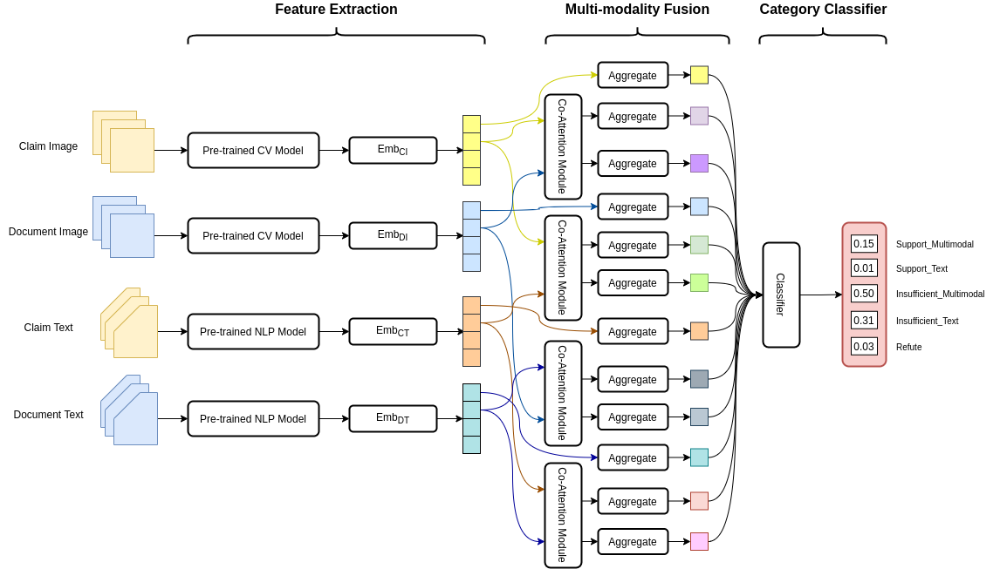
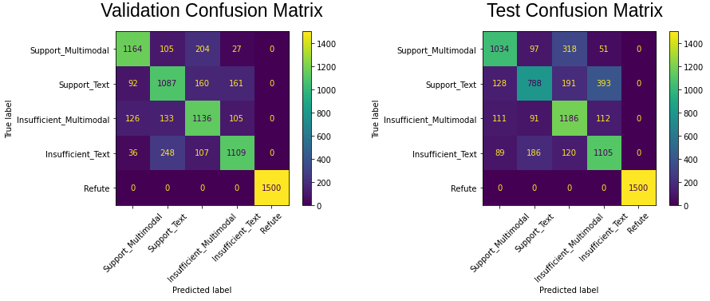
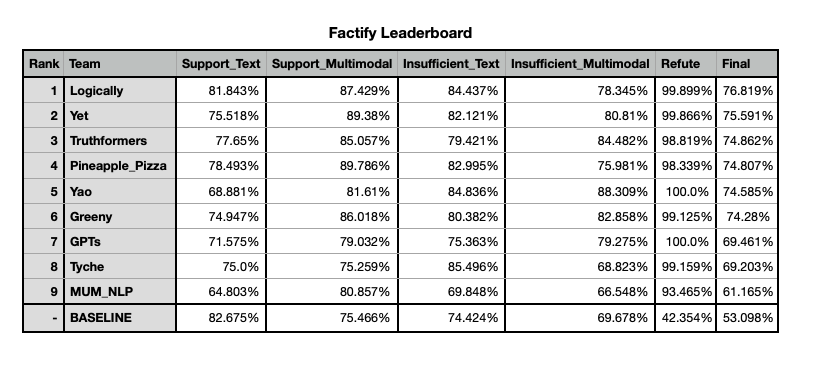

# Official code of Team Yao at Multi-Modal-Fact-Verification-2022
A Multi-Modal Fact Verification dataset released as part of the [De-Factify workshop in AAAI-22](https://aiisc.ai/defactify/).
We won the **fifth place** and the technical report can be viewed [here](https://arxiv.org/abs/2201.11664).

## Updated News
We propose the improved version, Pre-CoFactv2, winning the first prize at the [FACTIFY 2 Challenge](https://aiisc.ai/defactify2/factify.html). Please refer to the [new repo of Pre-CoFactv2](https://github.com/wwweiwei/Pre-CoFactv2-AAAI-2023) for more details.

## Challenge
The task is to find out support, insufficient-evidence and refute between given claims.

## Usage
- Train model
    ```
    bash single_model.sh
    ```
- Evaluate model
    ```
    python evaluate.py ${model_path}
    ```
- Ensemble models
    ```
    python ensemble.py
    ```

## Dataset
- Train set: 35,000, 7,000 for each class.
- Validation set: 7,500, 1,500 for each class.
- Test set: 7,500, 1,500 for each class.
For more details, please refer to [FACTIFY: A Multi-Modal Fact Verification Dataset](https://www.researchgate.net/publication/356342935_FACTIFY_A_Multi-Modal_Fact_Verification_Dataset).

## Metric
F1 averaged across the 5 categories. The final ranking would be based on the weighted average F1 score.

## Method Overview
<div align="left">

</div>
## Experiment Overview
<div align="left">

</div>

## Leaderboard
<div align="left">

</div>
